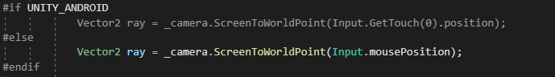

# AR инсталяция

# Helix Jump

Сделана с использованием Scriptable Object, для упрощенного создания уровней.

Link: _https://github.com/Shilaev/MyHelixJump_

__Пример создания уровня__

# Builder game

[в процессе разработки]

Link: _https://github.com/Shilaev/MyBuilderDefenderGame_

__Строительство зданий__

__Cinemachine camera__

В проекте исопльзуется cinemachine asset для более плавной камеры

__Добавление нового ресурса__

Все здания, ресурсы и кнопки генерируются на освное scriptable object.
Иконки и кнопки будут добавлены автоматически.

# Character Controller

### Написанн с исполозованием New Input System.

Link: _https://github.com/Shilaev/CharacterControllers_

__Управлять можно и с клавиатуры, и с геймпада__

__Анимации взяты с Mixamo__

__Input Actions__

__Пример кода реализации Input System__

__Компоненты игрока__

__Аниматор__

__Параметры захэшированы__

# Quiz game

__Пример работы на Android устройстве__

Простая игра, под Android. Поиск буквы или цифры.

# New input system на Android устройстве

Проект сделан с использованием new input system.
Демонстрируется работа джойстика и UI на Android устройстве.

# Endless Runner

Link: __https://github.com/Shilaev/MyEndlessRunner__ 

# Ping Pong

### Сделана без использования готовых алгоритмов физики Unity.

Link: _https://github.com/Shilaev/MyPingPong_

__Расчет нового направления мяча после столкновенияю. Мяч всегда летить под углом в 45 градусов__

__Игра подстраивается под рамки камеры, их можно делать шире, уже, столкновеня будут работаь в любом случае__

__Все расчеты размеров и точек столкновений написаны вручную__

__Ракетки не улетят за границы камеры, это предусмотрено в коде__

