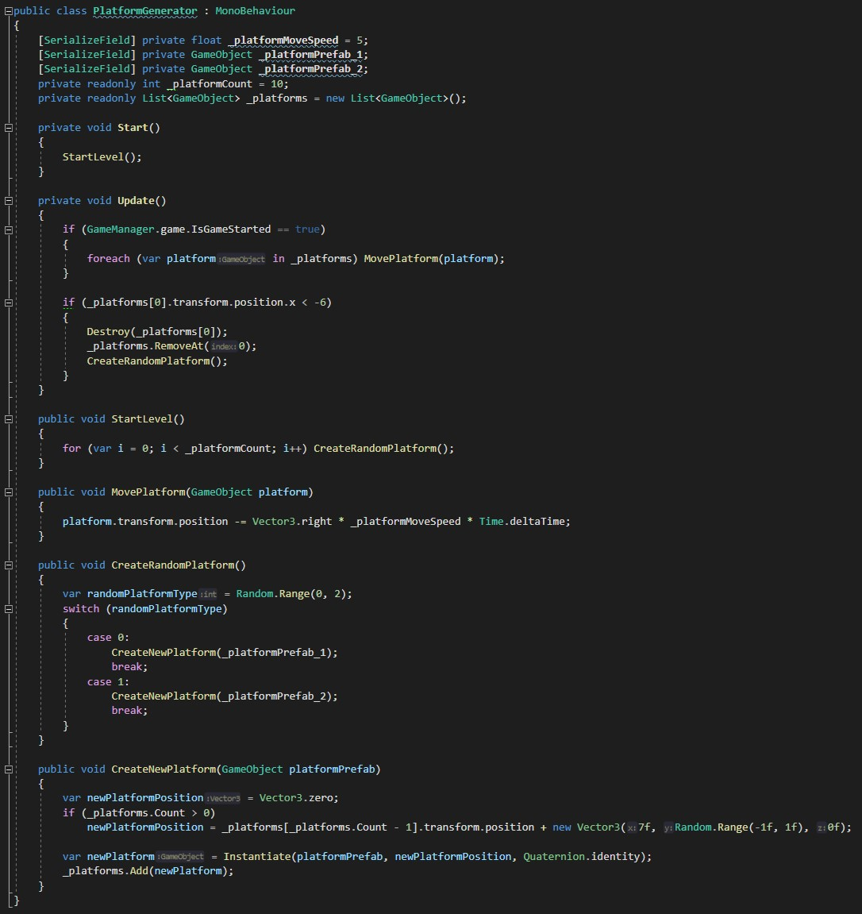

# Helix Jump
Сделана с использованием Scriptable Object, для упрощенного создания уровней.

Link: _https://github.com/Shilaev/MyHelixJump_

__Пример создания уровня__

# Builder game
[в процессе разработки]

Link: _https://github.com/Shilaev/MyBuilderDefenderGame_

__Строительство зданий__

__Cinemachine camera__
В проекте исопльзуется cinemachine asset для более плавной камеры

__Добавление нового ресурса__
Все здания, ресурсы и кнопки генерируются на освное scriptable object.
Иконки и кнопки будут добавлены автоматически.

# Первый Android билд
Проект сделан с использованием new input system, в учебных целях,
чтобы понять как работать с UI и джойстиками на мобильной платформе, с исопльзованием New Input system

# Endless Runner
По сути тестовый проект, который был сделан, чтобы понять как генерировать уровни,
а так же изучитьразные механики, подбирание монет, пауза|возобновление игры и так далее.

Link: __https://github.com/Shilaev/MyEndlessRunner__ 

__Генератор платформ__

# Character Controller
### Первый character controller, написанный с исполозованием New Input System.
Link: _https://github.com/Shilaev/CharacterControllers_

__Управлять можно и с клавиатуры, и с геймпада__

__Анимации взяты с Mixamo__

__Input Actions__

__Пример кода реализации Input System__

__Компоненты игрока__

__Аниматор__

__Параметры захэшированы__

# Ping Pong
### Первая игра. Сделана без исопльзования Unity физики в обучающих целях.
Link: _https://github.com/Shilaev/MyPingPong_

__Расчет нового направления мяча после столкновенияю. Мяч всегда летить под углом в 45 градусов__

__Игра подстраивается под рамки камеры, их можнод елать шире, уже, столкновеня будут продолжать работаь__

__Все расчеты размеров, точек столкновений и так далее написаны вручную__

__Ракетки не улетят за границы камеры, это предусмотрено в коде__

